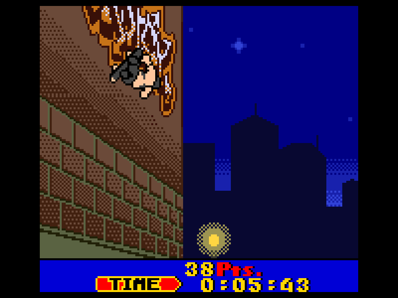
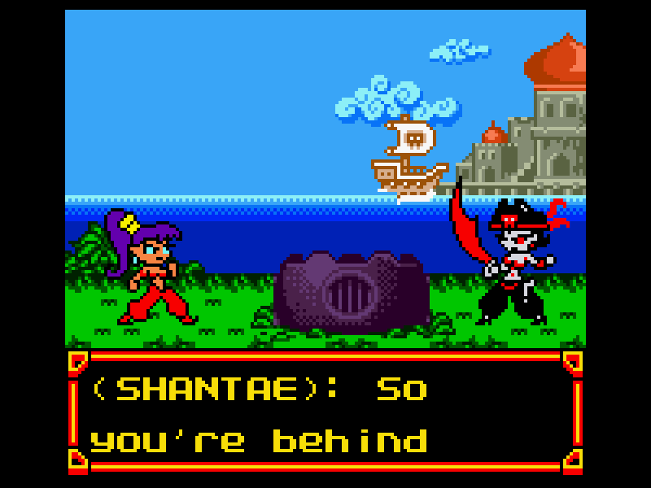
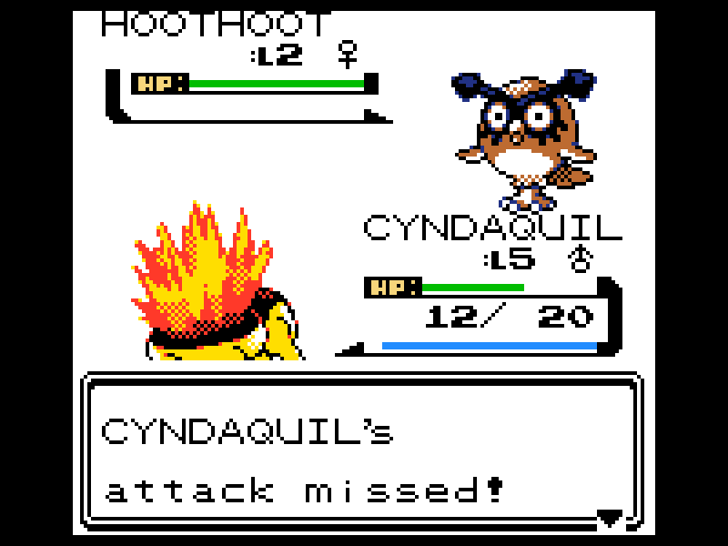
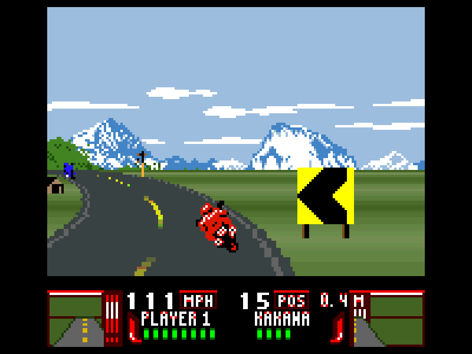
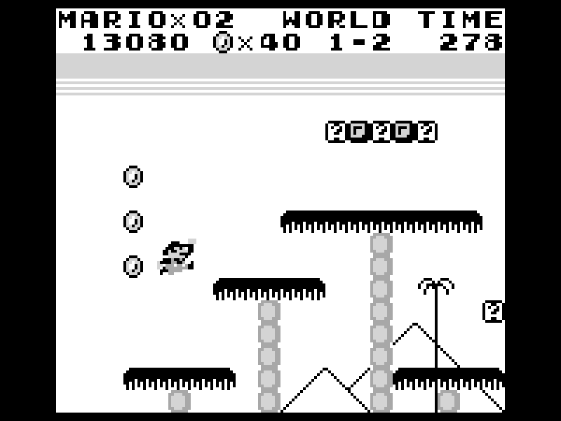

# Engram

A gameboy emulator that is still a work-in-progress.

  
  
  
  
  
  

## Controls

| Keyboard    | Button |
|-------------|--------|
| W           | Up     |
| A           | Left   |
| S           | Down   |
| D           | Right  |
| N           | A      |
| M           | B      |
| Enter       | Start  |
| Right Shift | Select |
| Esc         | Quit   |

`F1` key to dump data in sram to a .sav file for ROMs that are battery-backed.
