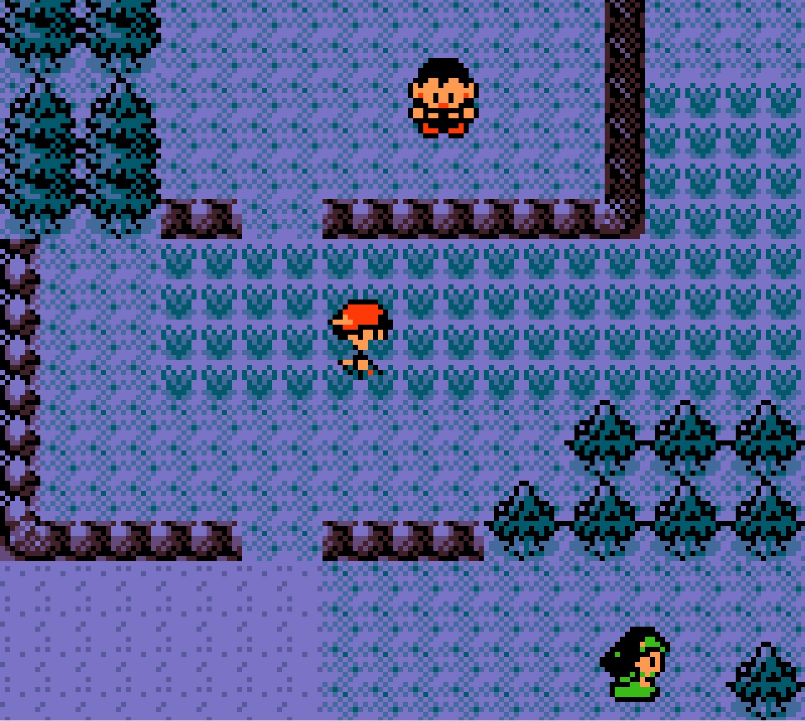

# Engram

A Game Boy Color emulator written in Rust.

<table align="center">
  <tr>
    <td></td>
    <td></td>
    <td></td>
  </tr>
  <tr>
    <td></td>
    <td></td>
    <td></td>
  </tr>
</table>

<i>Note: Pokemon Crystal battle sped up by dropping frames in <a href="https://github.com/NickeManarin/ScreenToGif">ScreenToGif</a>.</i>

## Controls

| Keyboard    | Button |
|-------------|--------|
| W           | Up     |
| A           | Left   |
| S           | Down   |
| D           | Right  |
| K           | A      |
| L           | B      |
| Enter       | Start  |
| Right Shift | Select |
| Esc         | Quit   |

`F1` key to dump data in sram to a .sav file for ROMs that are battery-backed.

## Usage
Either download the executable or clone the repository and run the following in a terminal:

``bash
git clone https://github.com/donishadsmith/Engram
cd Engram
cargo run
``
