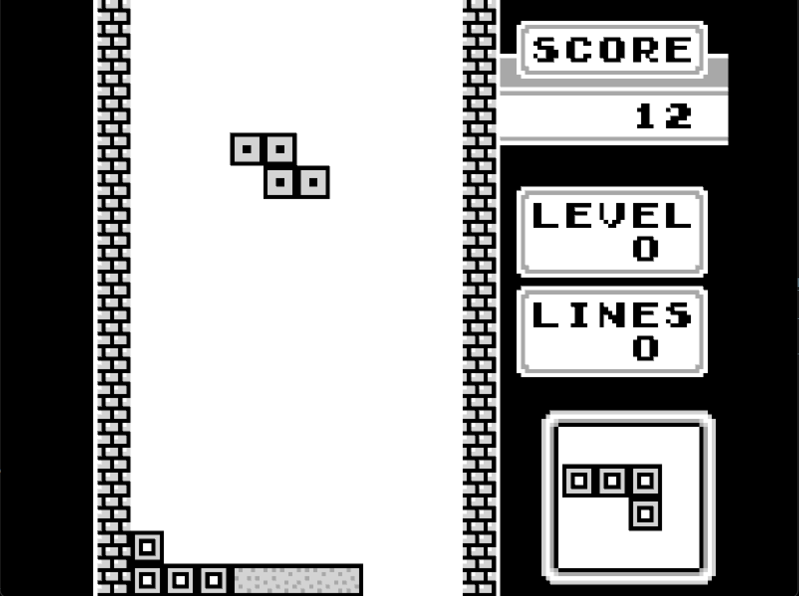
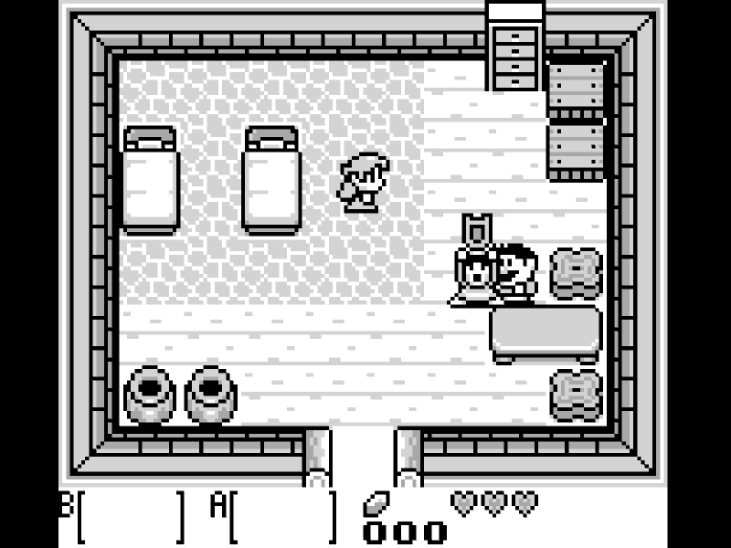
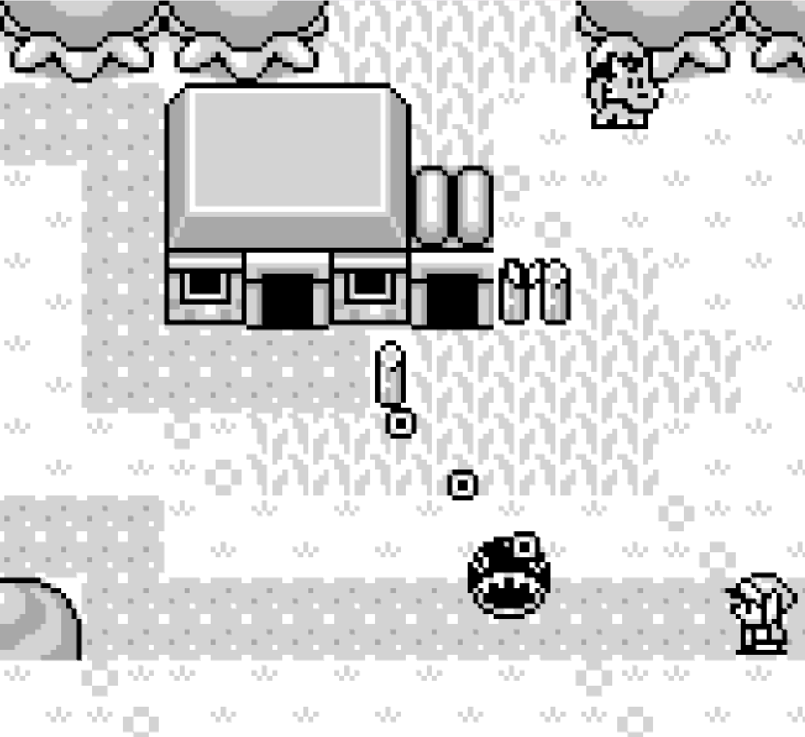

# Engram

A gameboy emulator that is still a work-in-progress.

  
  
  

## Controls

| Keyboard    | Button |
|-------------|--------|
| Arrow Up    | Up     |
| Arrow Left  | Left   |
| Arrow Down  | Down   |
| Arrow Right | Right  |
| Z           | A      |
| X           | B      |
| Enter       | Start  |
| Right Shift | Select |
| Esc         | Quit   |

`S` key to dump data in sram to a .sav file for ROMs that are battery-backed.
