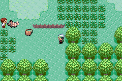
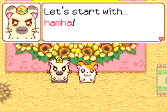
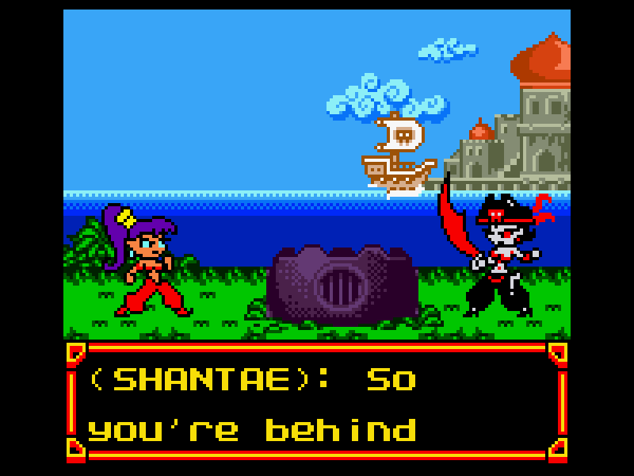
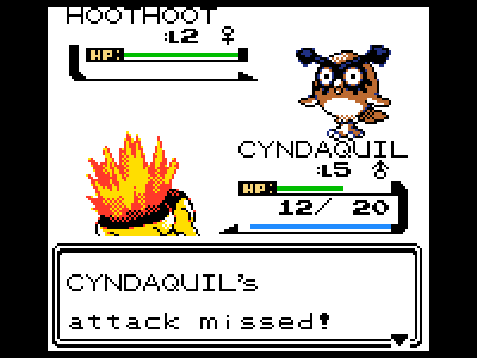
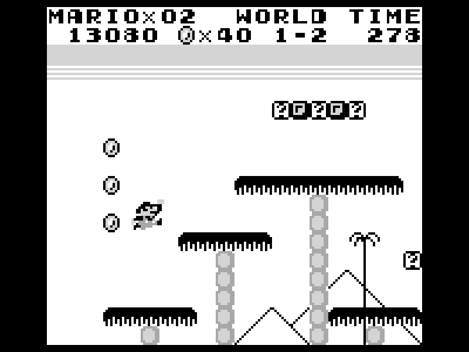

# Engram

[](https://github.com/donishadsmith/Engram/actions/workflows/test.yml)
[](https://github.com/donishadsmith/Engram/actions/workflows/build.yml)

A Gameboy Advance (RTC, APU [only mono fifo-based music with fixed volume], and some other PPU features still needs to be implemented) & Game Boy Color emulator (supports DMG games too) written in Rust.

<table align="center">
  <tr>
    <td align="center">
      
      <br>Megaman Battle Network 6 (GBA)
    </td>
    <td align="center">
      
      <br>Pokemon Emerald (GBA)
    </td>
    <td align="center">
      
      <br>Hamtaro Ham Ham Heartbreak (GBA)
    </td>
  </tr>
  <tr>
    <td align="center">
      
      <br>Shantae (GBC)
    </td>
    <td align="center">
      
      <br>Pokemon Crystal (GBC)
    </td>
    <td align="center">
      
      <br>Super Mario Land (GB)
    </td>
  </tr>
</table>

<p align="center"><i>Gifs captured with <a href="https://github.com/NickeManarin/ScreenToGif">ScreenToGif</a>.</i></p>

## Usage
In a terminal:

```bash
git clone https://github.com/donishadsmith/Engram
cd Engram
cargo run --release
```

## Controls

| Keyboard    |    GBA     |     GB/GBC      |
|-------------|------------|-----------------|
| W           | Up         | Up              |
| A           | Left       | Left            |
| S           | Down       | Down            |
| D           | Right      | Right           |
| L           | A          | A               |
| K           | B          | B               |
| Enter       | Start      | Start           |
| Right Shift | Select     | Select          |
| Esc         | Quit       | Quit            |
| I           | R          |                 |
| O           | L          |                 |

`F1` key to dump data into a .sav.
