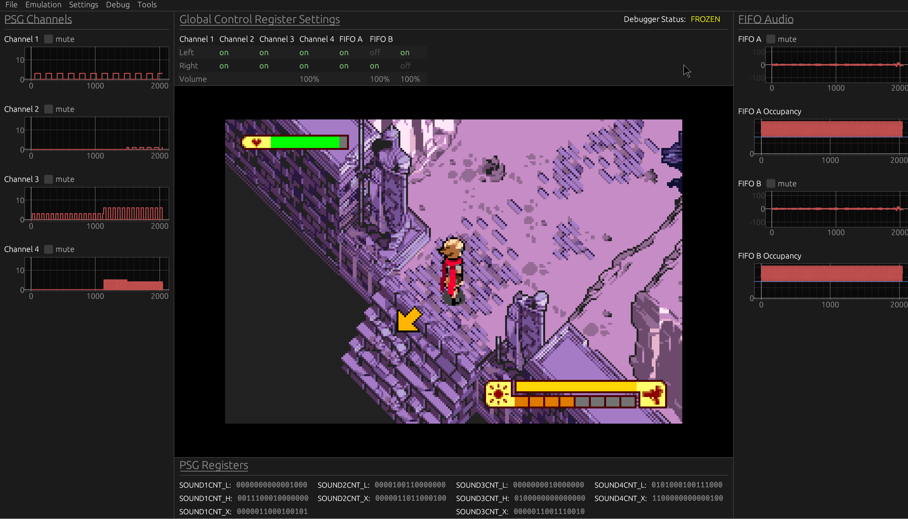
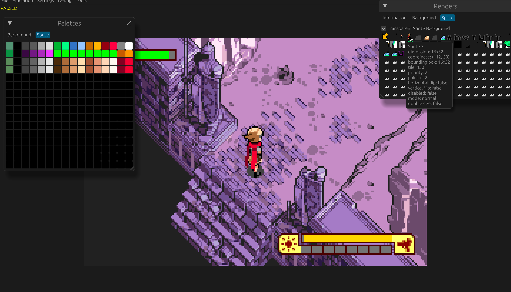
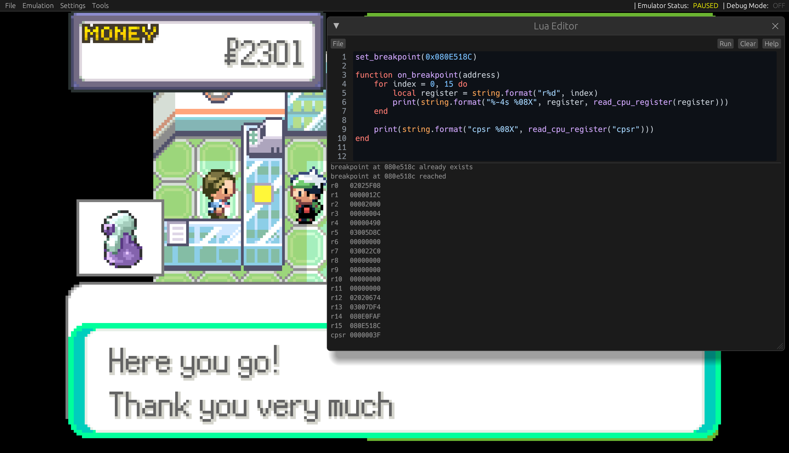

# Engram

[](https://github.com/donishadsmith/Engram/actions/workflows/test.yml)
[](https://github.com/donishadsmith/Engram/actions/workflows/build.yml)

A Gameboy Advance & Game Boy Color emulator (supports DMG games too).

<table align="center">
  <tr>
    <td align="center">
      
      <br>Megaman Battle Network 6 (GBA)
    </td>
    <td align="center">
      
      <br>Pokemon Emerald (GBA)
    </td>
    <td align="center">
      
      <br>Hamtaro Ham Ham Heartbreak (GBA)
    </td>
  </tr>
  <tr>
    <td align="center">
      
      <br>Shantae (GBC)
    </td>
    <td align="center">
      
      <br>Pokemon Crystal (GBC)
    </td>
    <td align="center">
      
      <br>Super Mario Land (GB)
    </td>
  </tr>
</table>

<table align="center">
  <tr>
    <td align="center">
      
      <br>Audio Debugger (GBA)
    </td>
    <td align="center">
      
      <br>Video Debugger (GBA)
    <td align="center">
      
      <br>Lua Editor (GB/GBA)
  </tr>
</table>

## Usage
```bash
git clone https://github.com/donishadsmith/Engram
cd Engram
cargo run --release
```

## References
I heavily relied on the prior work of the emulation development community while developing my own emulators. In particular, [mGBA](https://github.com/mgba-emu/mgba), [NanoBoyAdvance](https://github.com/nba-emu/NanoBoyAdvance), [rustboyadvance-ng](https://github.com/michelhe/rustboyadvance-ng), [retroboy](https://github.com/smparsons/retroboy), [SameBoy](https://github.com/LIJI32/SameBoy), [Pan Docs](https://gbdev.io/pandocs/), and [GBATEK](https://problemkaputt.de/gbatek.htm) were incredibly helpful. The full list of emulators, documentation, and articles used is in [REFERENCES.md](REFERENCES.md).
